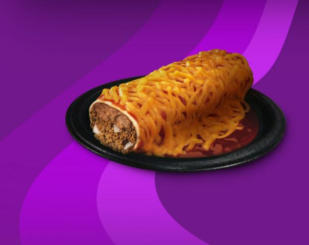

# favoritefood
 
<h2>List of Favorite Foods</h2>

<h3>Charlie's Favorite Foods:</h3>
 

1. El Gran Lomo Sandwich

2. Ñinos Envueltos

3. Tonkotsu Ramen

4. Beef Kofta with Kabuli Rice

5. Taco Bell's Secret Menu Item Enchirito

6. Anything with banana

<<<<<<< HEAD

Kiyomi's Favorite Foods: 
 

1. Plantain 
    
2. Pineapple
    
3. Avocado
    
4. Fried Oyester Mushrooms
    
5. Mac n Cheese
    
6. Curry Chickpeas
     